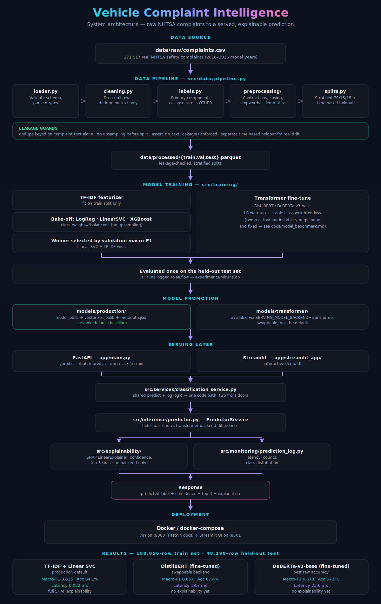

# Vehicle Complaint Classification


Production ML system that reads free-text NHTSA vehicle complaints and classifies them into fault categories (`ENGINE`, `SERVICE BRAKES`, `AIR BAGS`, etc.) — trained on **271,517 real safety complaints**, served through both a FastAPI backend and a Streamlit UI, and benchmarked across three model backends so the "which model should we ship" decision is measured, not assumed.

Rebuilt from a single academic notebook into a modular, tested, Docker-deployable pipeline. The redesign found and fixed real issues along the way — a label formulation that scored **F1=0.00** on several classes, a preprocessing bug that broke negation handling, two DeBERTa training-stability bugs — all documented, not swept under the rug. See [docs/Architecture.md](docs/Architecture.md) for the full audit.



**Contents:** [Results](#results) · [Try the API](#try-the-api) · [Quick start](#quick-start) · [Project layout](#project-layout) · [Documentation](#documentation) · [Testing](#testing)

## Results

Three model backends, all trained on the full 188,056 real NHTSA complaints and evaluated on the same 40,298-row held-out test set (majority-class baseline: 0.160 accuracy):

| Backend | Macro-F1 | Accuracy | Latency/sample | Explainability |
|---|---|---|---|---|
| TF-IDF + Linear SVC (production) | 0.625 | 0.641 | **0.022 ms** | Full (SHAP) |
| DistilBERT (fine-tuned) | 0.667 | 0.674 | 18.7 ms | Not implemented |
| DeBERTa-v3-base (fine-tuned) | **0.678** | **0.679** | 23.6 ms | Not implemented |

The linear model stays the production default — a >1000x latency and full-explainability tradeoff isn't worth ~5 points of macro-F1 for this app's use case — but both transformers are fully wired up and swappable via `SERVING_MODEL_BACKEND`. See [docs/model_benchmark.md](docs/model_benchmark.md) for the full writeup, including two real DeBERTa training-stability bugs found and fixed along the way (unstable class-weighted loss, missing LR warmup).

## Try the API

```bash
curl -X POST http://localhost:8000/api/v1/predict \
  -H "Content-Type: application/json" \
  -d '{"text": "The brake pedal did not engage properly and the car would not stop in time.", "explain": true}'
```

```json
{
  "predicted_label": "SERVICE BRAKES",
  "confidence": 0.6087,
  "top_k": [
    {"label": "SERVICE BRAKES", "confidence": 0.6087},
    {"label": "ELECTRICAL SYSTEM", "confidence": 0.1296},
    {"label": "POWER TRAIN", "confidence": 0.0718}
  ],
  "explanation": [
    {"term": "brake", "contribution": 0.6474},
    {"term": "not stop", "contribution": 0.2595}
  ],
  "explanation_method": "shap",
  "model_backend": "baseline",
  "latency_ms": 14.7
}
```

Negation is preserved on purpose — `preprocess_for_classical` keeps words like "not" out of stopword removal, so "did **not** engage" and "engaged" don't collapse to the same signal. Full endpoint reference (batch predict, metrics, retrain) in [docs/API.md](docs/API.md).

## Quick start

```bash
pip install -r requirements.txt
pip install -e .   # editable install so `from src...` imports work everywhere

# 1. Build the dataset (validate -> clean -> label -> preprocess -> split)
python -m src.data.pipeline

# 2. Train the baseline model
python -m src.training.train

# 3. Serve the API
uvicorn app.main:app --reload

# 4. Run the Streamlit app (separate terminal)
streamlit run app/streamlit_app/Home.py

# 5. Run tests
python -m pytest tests/ --cov=src --cov=app
```

Or with Docker:

```bash
cp .env.example .env
docker compose up --build
# API: http://localhost:8000/docs   Streamlit: http://localhost:8501
```

## Project layout

```
data/{raw,interim,processed}   raw NHTSA CSVs -> cleaned -> train/val/test splits
src/                            all business logic (see docs/Architecture.md)
app/                            FastAPI entrypoint (main.py) + Streamlit app (streamlit_app/)
models/production/              promoted, servable model artifacts
artifacts/                      full experiment output (reports, confusion matrices, benchmarks)
experiments/mlruns.db           MLflow tracking store
tests/                          unit, data_validation, integration, api
docs/                           architecture, API reference, training, deployment
```

## Documentation

- [docs/Architecture.md](docs/Architecture.md) — full system design, folder rationale, data/leakage audit findings
- [docs/API.md](docs/API.md) — FastAPI endpoint reference
- [docs/Training.md](docs/Training.md) — training pipeline, MLflow, retraining, GPU scale-up
- [docs/Deployment.md](docs/Deployment.md) — Docker/docker-compose, environment variables
- [docs/model_benchmark.md](docs/model_benchmark.md) — baseline vs. DistilBERT vs. DeBERTa-v3-base comparison

## Testing

101 tests across `tests/unit`, `tests/data_validation`, `tests/integration`, `tests/api`. Overall line coverage is 71% — effectively ~98%+ across all business logic modules (preprocessing, labeling, cleaning, splitting, models, evaluation, explainability, inference, API). The gap is concentrated entirely in three CLI orchestration scripts (`src/data/pipeline.py`, `src/training/train.py`, `src/training/train_transformer.py`) that wire together already-unit-tested functions and write large artifacts to disk over several minutes — these are verified by the real, successful end-to-end runs documented in `docs/model_benchmark.md`, not by mocked unit tests that would only assert call ordering.

```bash
python -m pytest tests/ --cov=src --cov=app --cov-report=term-missing
```
